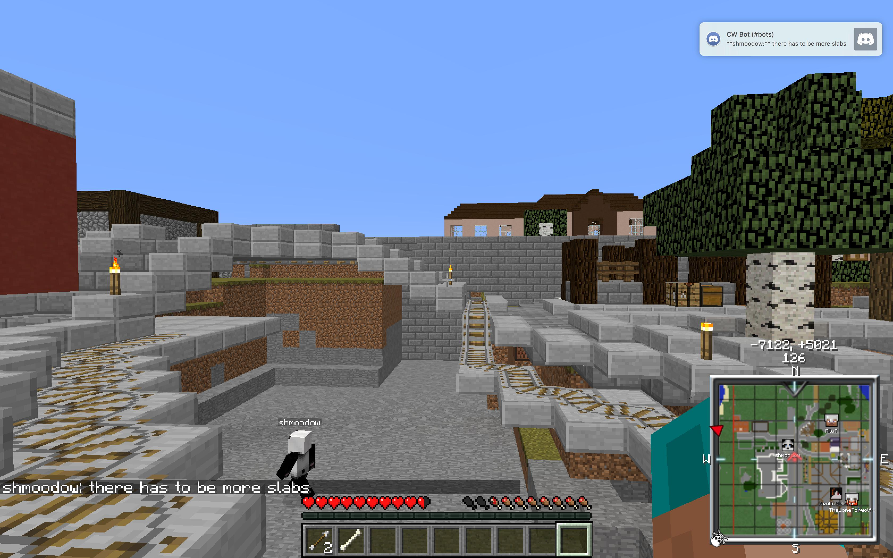

Orinnari's [Reddit post](https://www.reddit.com/r/civclassics/comments/6id1j7/miloy_isnt_a_worthy_citizen/).

> Today, MiloY has gone on a rampage of spite that should exile him from the CommonWealth community. He has an exorbitantly large claim within the town centre, not for farmland, but his own personal playground. Alone that is not just cause, however, his recent actions should show everyone what kind of person he is, and how he interacts with the community at large.
> 
> Unfortunately I do not have screenshots for this as I didn't think it prudent at the time. Nonetheless, he started yelling in the chat at whoever had made the pattern at the bottom of the canal. He then went about destroying it, taking with it some of the sidewalk, his reasoning being that he made it, therefore he can destroy it. Here is the result of that:
> 
> Not awful, but still annoying.
> 
> After that, he decided to turn the one block high marker he used to border his territory into a full blown reinforced wall.
> 
> 
> Notice that any property that happens to land on or slightly pass the wall has been destroyed without regard for or notice to the inhabitants. (Although it has been revealed that one of the houses is actually property of one of his friend's girlfriend, so he's now doing damage control.) But [this](http://imgur.com/Ob9Zfbw) (link expired) is him actively destroying other people's property, their _reinforced_ property. His reasoning being that because it oversteps his border, he has every right to do whatever he wants without regard or consideration.
> 
> Let me show you my house:
> 
> It's not much, for now, but as you can see, it happens to go right up against his wall. So at one point, I hopp one block to the left and move up to him destroying the house to take screenshots. And he tells me to get lost. I refuse. He then takes out his sword and tries to hit me. I move back to my house, and he fellows. I run away as fast as I can, and he follows me roughly 200 blocks away:
> 
> ([bigger view](http://imgur.com/aAVgoVl) - expired link) and then takes all the items that dropped. I ask him to give me back my belongings, and he says he would on the condition that I humiliate myself and sincerely apologise and promise never, ever to infringe on his property again:
> 
> So it leaves me with this odd situation:
> 
> which I cannot win because I am a builder, not a PvPer.
> 
> He has also since killed another CommonWealth citizen for chopping down a tree they had planted. His reason being that the trees were on his land. But I don't see why he should have a problem with this seeming that he had no qualms destroying the canal.
> 
> So... if someone could pearl him, that would be great.

----

MiloY's [response](https://www.reddit.com/r/civclassics/comments/6id1j7/miloy_isnt_a_worthy_citizen/dj59wvp/) in comments, and in a [separate post](https://www.reddit.com/r/CivCommonwealth/comments/6iflfc/regarding_what_happened_last_night/).

> Hi guys, Milo Y here,
> 
> Most of the items in this post are true. I haven't been able to play as much as I want to lately -- however, I am able to dedicate a few hours a day give or take. It would appear this isn't enough.
> 
> Every time I undertake a project, somebody comes in and fucks with it before I login the next day. For example, there was a set of derelict above-ground tracks running through the CW. I contacted fin600, one of the people that had worked on them to let them know hey -- they were an eyesore and going unfinished. I let her know we should build a nice canal there instead. She said she preferred a canal.
> 
> With that, I spent 4-5 hours digging out a massive canal. I login today, and shmoodow had the liberty of building in the canal while I was away without checking in our discord -- it was clearly a work in progress. I removed what he had built, not knowing whose it was to yell at beforehand.
> 
> I start digging a subway tunnel, it takes me about 9 hours. I logoff. Login the next day, and someone has decided to build their own roads through it.
> 
> These things are supposed to be coordinated in the discord. It's very frustrating to dedicate lots of time to public builds only to have someone come in and 'help' you work on them. 
> 
> Not wanting a repeat of this, I walled off a decent sized plot which I had started building on the first day of the server. I wanted this sliver to be nice and to have it be VERY CLEAR this was someone's property -- not to 'help' work on it. It is currently being transformed into a gatehouse for access to a lower bridge, and quasi-public rail tunnels. I put up a cobble wall with signs spanning it after terraforming the area to mark it as such.
> 
> Sure enough, I login today and three houses had built across the clearly marked and signed fence and into my plot. Having enough of this, I removed the portions of the structures that were on my side, and increased the height of my wall drastically to make the demarcation of property clearer.
> 
> All the while shmoodow and orinnari were harassing me because they didn't think what I was doing was 'fair'. They repeatedly put vulgar re-enforced signs up on my property calling me a 'faggot', griefed one of my tunnels, and then proceeded to chop down trees on my property. I asked them to stop and was told 'no', and that 'I planted these so they're mine'. 
> 
> I killed but didn't pearl both on one occasion each after many warnings. I offered to return the few pieces of iron that were picked up from Orinnari when he died on the condition that he agree not to tresspass again. It was at this time Shmoodow put up a stink about the 'canal he had built' demanding I return the quartz. I gladly fetched all of the quartz and 7 stacks of smoothstone to more than 'compensate' him -- but mainly, just to appease them even though he had built in my canal.
> 
> Since then both have been stirring up things in the CW discord in an attempt to have people complain against me on their behalf. These include Eddie.exe (Eddiison2013) and TMPS, who was one of the offending builders. I've located the other 2 builders and am working amicably with them to get it resolved -- as far as I am concerned, there is no issue with the builders.
> 
> I would just like to be left alone on my own land. I would like people to stop putting their hands in my builds. It's unfortunate that the situation has turned into such harassment and that I've had to build an ugly wall.
> 
> Normally, the subreddit is reserved for more 'important' discussion -- however, I felt the need to comment in on this situation, as it's my character being publicly questioned.
> 
> Thanks,
> 
> Miles

----

Orinnari's [reponse](https://www.reddit.com/r/civclassics/comments/6id1j7/miloy_isnt_a_worthy_citizen/dj66usf/) to that, in comments.

> Most of the items in this post are true, to my understanding anyway, but just wanting to clarify.
> 
> > I walled off a decent sized plot
> 
> _"Decent"_.
> 
> > These things are supposed to be coordinated in the discord. It's very frustrating to dedicate lots of time to public builds only to have someone come in and 'help' you work on them.
> 
> Could you provide a screenshot of your discussion in the Discord about this project, and any and all ingame signs that notifying that you were working on something and didn't want interference? Also, could you point out at what point was there and understanding that these things you were building were not public infrastructure, but in essence an extension of your claim, therefore you can do with it what you wish, including destroying it if and when you have a tantrum?
> 
> > three houses had built across the clearly marked and signed fence
> 
> Actually, it _wasn't_ clearly marked. You wall was one block high and made from stone bricks. Wanna guess that their plot borders were made out of, and wanna guess how high they were?
> 
> > Having enough of this, I removed the portions of the structures that were on my side
> 
> On your _side_, which you have repeatedly stated, which by definition should not really include the wall itself, but apparently it does to you. There are many instances of building _ON_ the border of something within the capital, for instance, the _roads_, for a lack of a better term, have side walks, but many houses are built on top of the sidewalks instead of _just_ within the confines of the plot, giving a block or so of extra space. Perhaps it is annoying that those houses were build on or slightly passed your border, but like what you have written was so annoying to you (people doing stuff to your builds without your permission) you have now done to them with prejudice. You could say an eye for an eye, but they didn't do it purposefully, or with real spite.
> 
> > harassing me because they didn't think what I was doing was 'fair'
> 
> That is a very loose definition of harassing, and honestly, quite an offensive use, because if you've ever been actually harassed, then you know the stark difference. We were following and screenshotting your brash actions, telling you to stop, and to stop being an asshole. (And being an asshole you freely admitted to, and even said you were smiling at all this stuff you were causing.)
> 
> > They repeatedly put vulgar re-enforced signs up on my property calling me a 'faggot'
> 
> I didn't place any signs of the sort, nor have I ever placed any on your property, including the wall. I have placed one sign _in front of_ the wall stating that you are not to be trusted, because after your actions, it's rather appropriate.
> 
> > I asked them to stop and was told 'no', and that 'I planted these so they're mine'.
> 
> Well considering that you were whining in the chat that the canal was yours, therefore you have every right to destroy it rather than just leave it there, because, you know, you were cutting yourself off and all. I consider it fair that if you can destroy public infrastructure that's not within your claim just because you built it, then he can chop down trees that he planted, even though they were not in his claim. Seems fair to me, and doesn't deserve being killed.
> 
> > I asked them to stop and was told 'no'
> 
> I was standing on a wall, not harming you at all. I was screenshotting your actions. And because of this, you deemed this so harmful to your ego that you chased me not only off the wall, but to my house, and then for another 170 blocks. That is in no way self defence, nor was the killing warranted, but the chasing was certainly not.
> 
> > I killed but didn't pearl both on one occasion each after many warnings.
> 
> Oh, you didn't pearl? How _gracious_ of you, my lord. And no, you did not warn us several times. This is the fourth time I have asked you to produce screenshots of you demanding several times, and yet you still have no produced them. My guess is that they do not exist, and you are simply exaggerating. I don't remember being asked several times to get down from a wall because that's your property. I remember being told, once, to get lost. And was then chased down, killed, and robbed.
> 
> > I offered to return the few pieces of iron that were picked up
> 
> That _you_ picked up. And yes, you mocked me then, and continue to mock me now over how poor I am in game. But you know that is not an _offer_ anyone would choose, because no one would rightly grovel at your feet to have their own items returned to them after a death that was not justified in any way.
> 
> > when he died
> 
> That's a nice euphemistic way of saying that you tracked, killed, and robbed me.
> 
> > on the condition that he agree not to tresspass again.
> 
> I believe the quote itself was: "Please write a formal written apology for the tresspass and state that you wont be doing it again." Like, _excuse me._ You want a formal written apology? For standing on a wall? Screenshotting your actions? Would you like me to kiss your shoes too?
> 
> > just to appease them
> 
> To appease _him._ You still have my items, even though you still mock them. I guess you like keeping whatever little a poor person has, after all, don't you have a sign on your manor that says, "fuck the poor"?
> 
> > Since then both have been stirring up things in the CW discord
> 
> As have you. Don't play coy.
> 
> > I would just like to be left alone on my own land. I would like people to stop putting their hands in my builds. It's unfortunate that the situation has turned into such harassment and that I've had to build an ugly wall.
> 
> This is amusing. You want to be left alone, and yet you have injected yourself into many, _many_ different people's builds? Instead of doing anything diplomatically or even decently. And I NEVER did anything with your builds. You are angry at someone else with that.
> 
> > Normally, the subreddit is reserved for more 'important' discussion -- however, I felt the need to comment in on this situation, as it's my character being publicly questioned.
> 
> You said you made a Reddit post, and yet you have not linked it. Nor has anyone ever linked a CW subreddit. And so I posted on here, because unlike discord, it allows for lengthy posts that can actually be read without being pushed up. And also, in order for your character to be questioned, you actually have to have character. Being a one dimensional asshole does not constitute character. But your _character_ is not being questioned here, you've got that among other things wrong. Your _actions_ are.