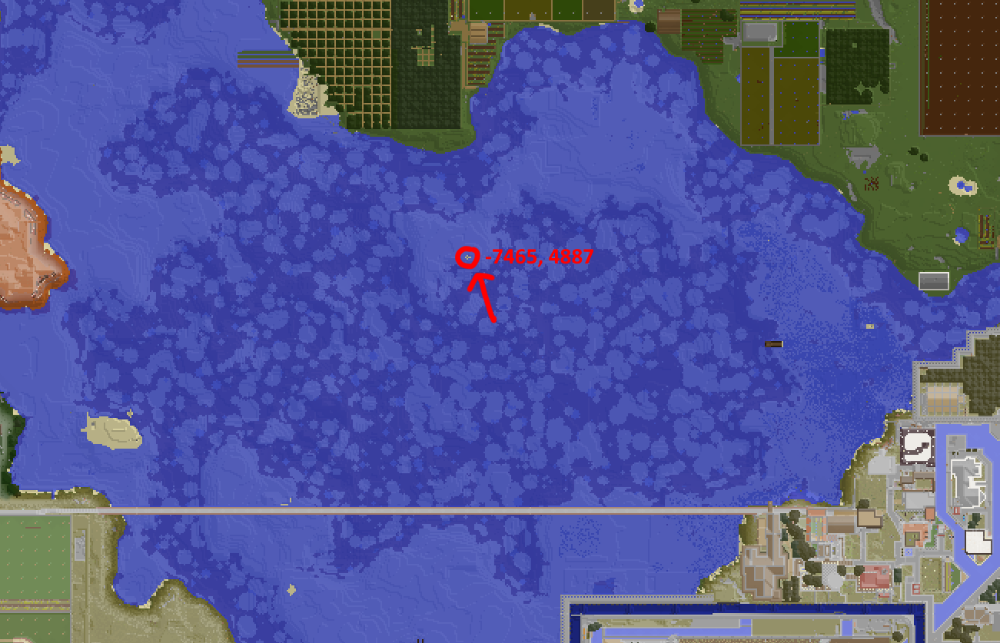
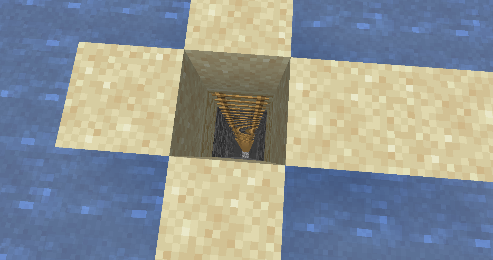
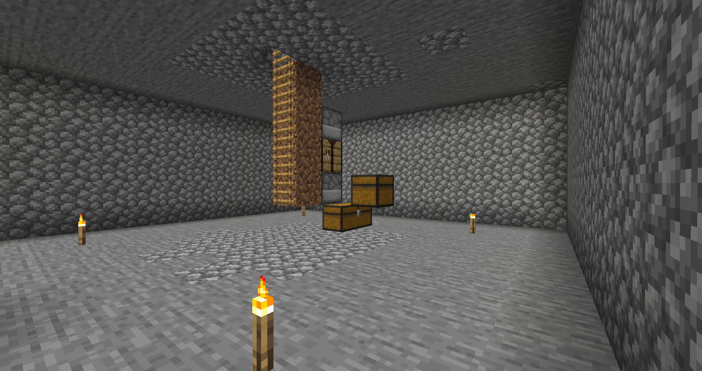
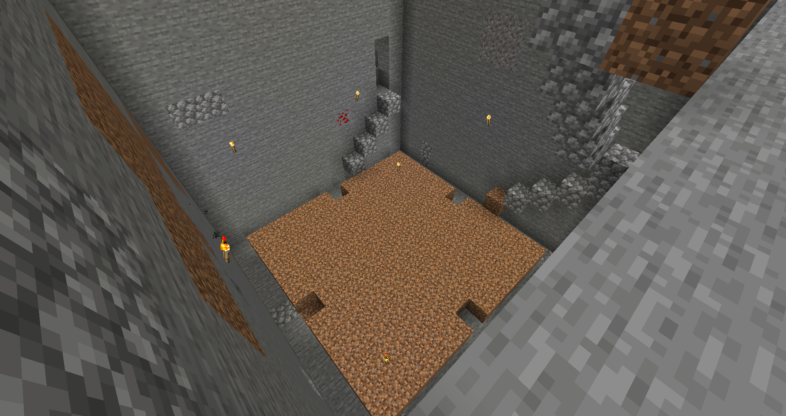

In an attempt to protect himself from raiders, Orinnari built the beginnings of an underground base with the idea of growing food and wood underground, though this was abandoned when he discovered nothing would grow in ocean biomes nor underground.

Below is the beginnings of a tree farm:

