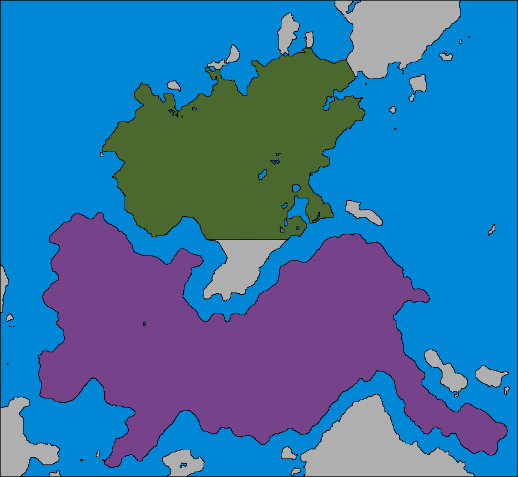

Southshire has three levels of land claim:

 1. Primary – The primary and most legitimate claim of the borough.

 2. Secondary – Legitimate expansion claims.

 3. Tertiary – Small or micro islands.

## Claims

 * **Southend**, the claim shown in green, is Southshire's primary land claim, which constitutes the majority of the Southwestern Peninsular.

 * **South Island**, as it has yet to be officially named, is the claim shown in purple, and is Southshire's secondary land claim. The claim comprises of the entire continent directly below Southend.