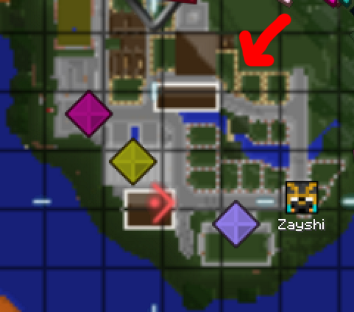
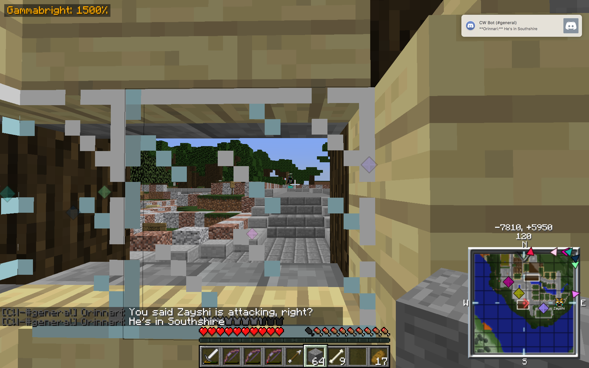
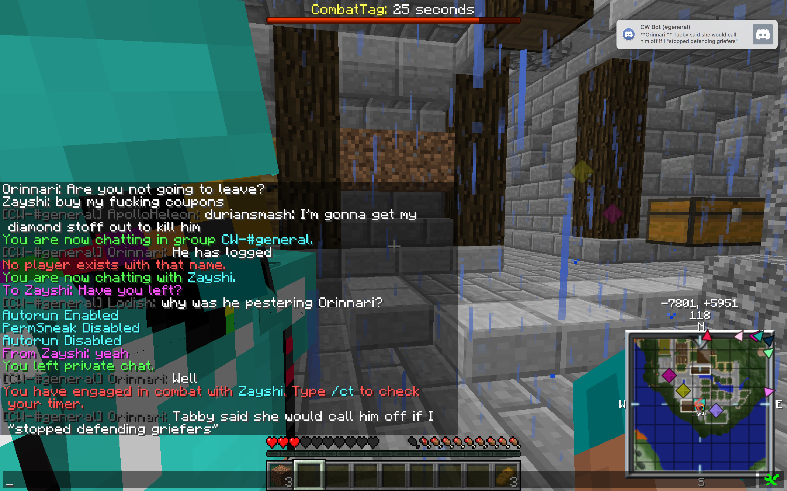

An account of how Tabby, a citizen and trusted member of the Commonwealth at the time, hired a bounty hunter to find and or track DurianSmash, a new friend at the time accused of having griefed Tabby’s basement, and was invited to live within Southshire.

At the time of the incident, DurianSmash had not built within Southshire. He would eventually build a house within the plot indicated below:


----

On Sunday 2nd July 2017 a player named Zayshi entered Southshire and began acting ominously.

```
[22:27] DurianSmash: who is zayshi
[22:28] DurianSmash: Why does he have facatory access

[22:30] UNKNOWN: dunno but people were talking to him earlier

[22:33] DurianSmash: He is attacking

[22:42] Orinnari: You said Zayshi is attacking, right?
[22:42] Orinnari: He's in Southshire
```

```
[22:43] Siriann: There's a gerfer going around?

[22:43] Orinnari: Apparently

[22:44] MiloY: whats the name?

[22:44] Orinnari: Zayshi

[22:44] Tabby: he's not a griefer
[22:44] Tabby: he's a bounty hunter, he has a house in town
[22:44] Tabby: he's after durian cause I bountied him

[22:44] Orinnari: So if I went outside, he won't kill me?
[22:46] Orinnari: Could you ask your bounty hunter to leave Southshire?

[22:47] Tabby: depends, are you gonna stop defending griefers?

[22:48] Orinnari: Great, so you're actually griefing me

[22:48] Tabby: I would never grief

[22:48] Orinnari: You're a small, petty little human, aren't you?

[22:48] Tabby: I do send bounty hunters after people who grief me though

[22:48] Orinnari: Considering your bounty hunter is now placing dirt in front of my windows.

[22:49] Tabby: well, he never pearled durian, just killed him over and over again

[22:49] Orinnari: He is refusing to leave Soutshire, and is actively placing blocks

[22:49] UNKNOWN: what gear is he wearing orinnari?

[22:49] Orinnari: He said "haha pranked"

[22:49] DurianSmash: Please get him and return my armor and glass
[22:49] DurianSmash: He has all d, not enchanted

[22:49] Orinnari: He's wearing diamond armour, not enchanted

[22:50] DurianSmash: is he logged in?

[22:50] Orinnari: Yup, he's still here

[22:50] DurianSmash: where

[22:50] Tabby: if durian says he won't grief my house again I'll tell him the bounty's dropped

[22:51] DurianSmash: I won't. But you can't let raiders go all over
[22:51] DurianSmash: And he even has WC access.

[22:51] Orinnari: He's wandering around, going through my chests
[22:51] Orinnari: actively and deliberately placing blocks

[22:51] Tabby: yeah, he's a citizen
[22:51] Tabby: he lives in town

[22:51] MiloY: i dont think this constitutes as a 'raider'

[22:52] Orinnari: Never said he was a raider

[22:52] Tabby: it doesn't, he just kills people for money

[22:52] DurianSmash: Someone remove him please
[22:52] DurianSmash: orrinari, where is he?

[22:53] Orinnari: He's in Southshire.

[22:55] DurianSmash: I'm gonna get my diamond stoff out to kill him

[22:56] Orinnari: He has logged

[22:57] Lodish: why was he pestering Orinnari?

[22:57] Orinnari: Well
[22:58] Orinnari: Tabby said she would call him off if I "stopped defending griefers"
[22:58] Orinnari: And he is attacking me

[22:58] Tabby: I did call him off

[22:58] Orinnari: I just asked him whether he left
[22:58] Orinnari: He said yes, and he's still here
[22:58] Orinnari: And has attacked me
[22:59] Orinnari: Obviously he respects your commands.

[22:59] MiloY: out of the blue attacked?

[22:59] Orinnari: Yup

[22:59] specificlanguage: are we still bounty hunting the bounty hunter

[22:59] DurianSmash: Yes
[22:59] DurianSmash: he has my stuff
```

```
[23:00] Lodish: so.... there's no bounties now right?

[23:00] Tabby: nope
[23:01] Tabby: I dropped durian's because he promised not build under my house again
[23:02] Tabby: orrinari never had one to start with, I just said he might try stuff if durian was pearled
[23:02] Tabby: guess he bounty hunted a little strong
[23:02] Tabby: hopefully all good
[23:02] Tabby: he should be giving you stuff as reps for griefing your house
[23:02] Tabby: I yelled a little
[23:03] Tabby: apologies

[23:03] Orinnari: His "reps" are going to despawn.
[23:03] Orinnari: I did not want his reparations. I wanted him to leave.
[23:04] Orinnari: But your vendetta against a "griefer" had brought all this on.

[23:04] Tabby: has he not left?

[23:05] Orinnari: I believe so. He is not in the town centre anymore, but whether he's still in Southshire is... I dun

[23:05] Tabby: he should be gone

[23:05] Orinnari: Good.

[23:05] Tabby: you dont' have a bounty, and he was only meant to be watching you anyway
[23:05] Tabby: hence the reps

[23:05] Orinnari: You set someone to watch me?
[23:05] Orinnari: Excuse me, what the actual fuck?

[23:05] Tabby: yeah you defended griefers
[23:06] Tabby: figured you might be gearing him

[23:06] Orinnari: You sent someone 1000 blocks to watch me?

[23:06] Tabby: I take lawbreaking very seriously

[23:06] Orinnari: Wow, you arebatshit.
[23:06] Orinnari: You and your "bountyhunter" are not welcome inside the bounds of Southshore.
[23:06] Orinnari: Southshire*

[23:07] Tabby: you'll have to tell him yourself
[23:07] Tabby: as you can see, I have very lax control

[23:07] Orinnari: Haha
[23:07] Orinnari: Seeimg he is hired by you
[23:07] Orinnari: To literally surveil me
[23:07] Orinnari: I'm so glad I left the Capital
```